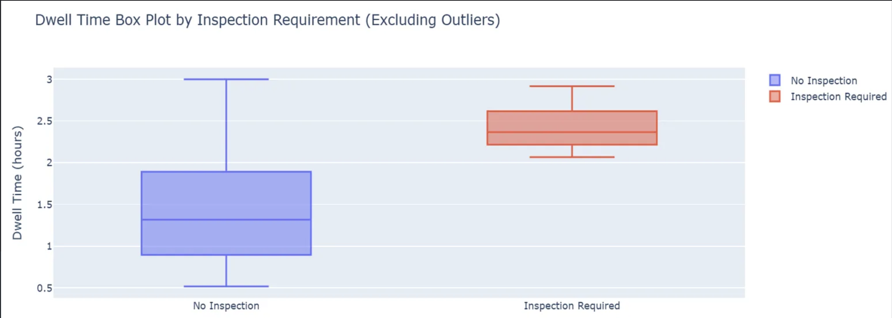
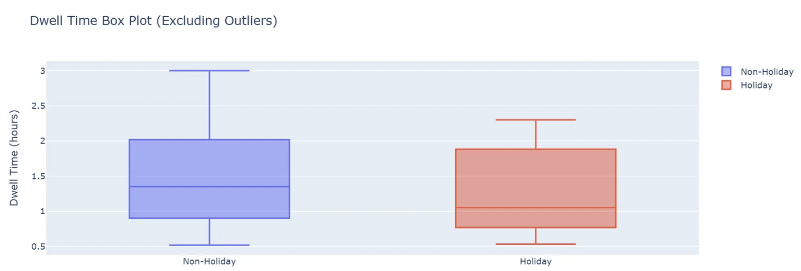
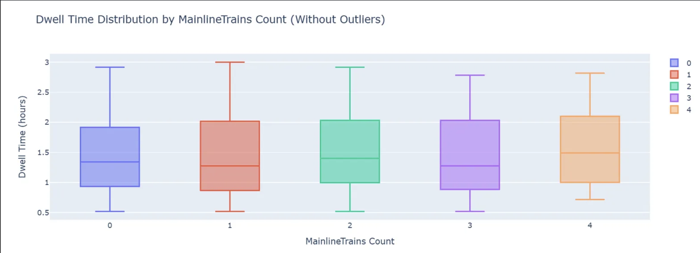
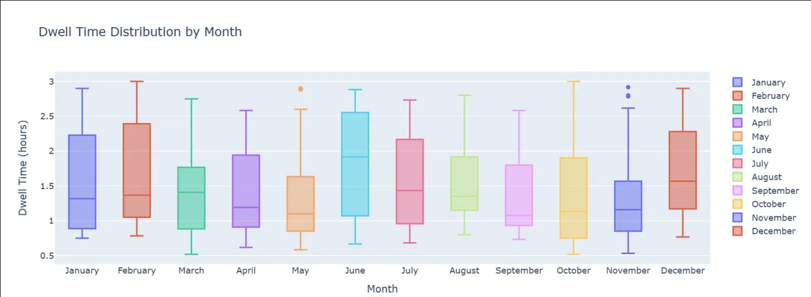
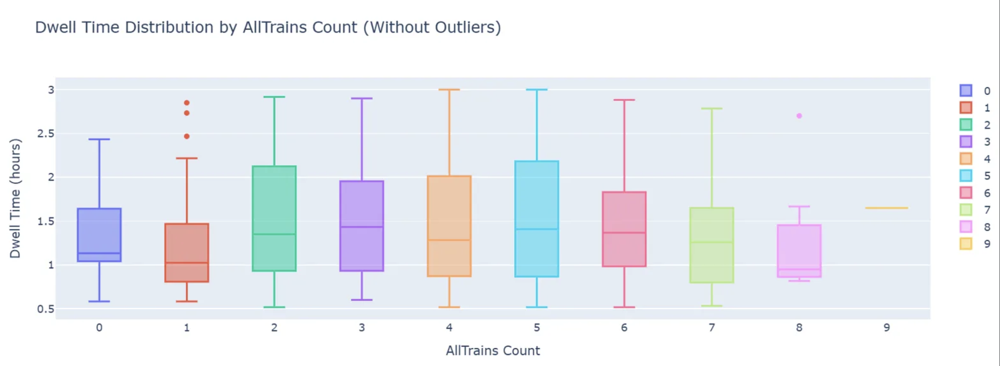
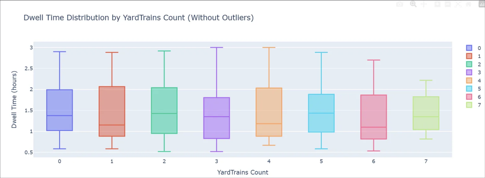
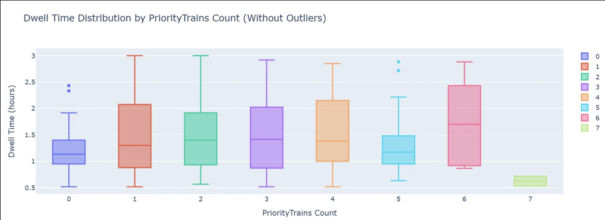
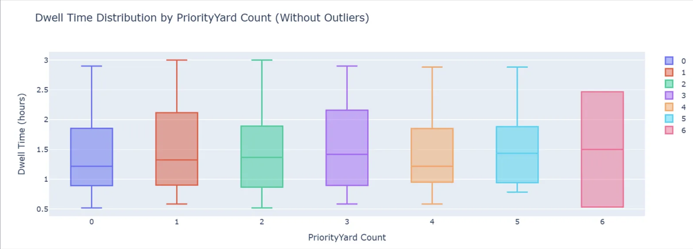
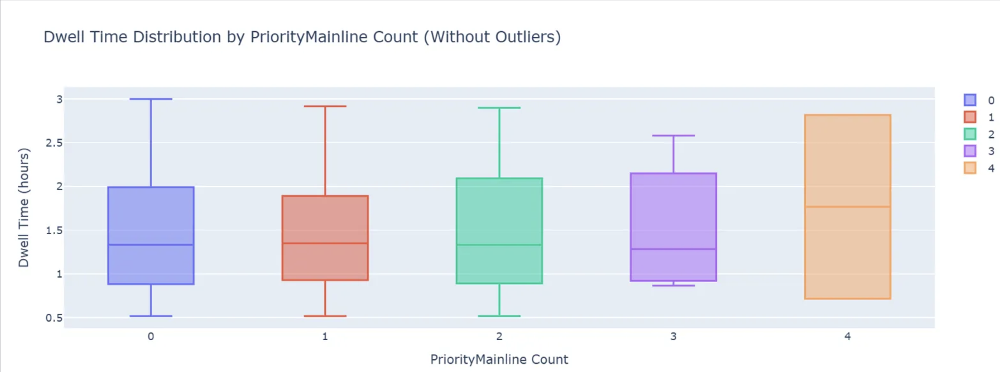

# 🚆 Train Dwell Time Prediction

## 📍 Context & Motivation
India’s public transport system is vast, vital, and… deeply flawed. From overcrowded stations to unpredictable delays, the railways suffer from poor infrastructure, inconsistent management, and a lack of real-time planning tools. Train delays are not just an inconvenience — they are part of daily life, often leading to missed connections, lost goods, and collective frustration.

In this context, improving the **prediction of dwell time** (the time a train spends at a station) becomes a powerful lever to enhance efficiency and reduce chaos. This project was initiated in collaboration with an Indian railway company aiming to **predict train dwell times more accurately using AI models**.

---

## 🎯 Objective
We focus on a particular set of trains and aim to model their **dwell time at the station "MINOT"**, which we define as the **last true change point** for all trains in the dataset.

> 🔎 **Dwell Time** = `Departure Time at MINOT` – `Arrival Time at MINOT`

---

## 📚 Notebooks Overview

This project is structured in 4 main notebooks:

---

### `01_EDA_Dwell_Time_Data.ipynb`
We explore the raw dwell time dataset using a classic EDA workflow:
- Distribution plots
- Categorical feature exploration
- Missing value handling
- Basic cleaning and formatting

---

### `02_Outlier_Detection_and_Removal.ipynb`
Outlier detection is essential to avoid skewed predictions.

- **First attempt**: IQR-based filtering → ❌ Ineffective due to skewed distribution.  
- **Second attempt**: Custom binning strategy → ✔️ More robust.

**Steps:**
1. Train/test split based on arrival date (training = before Jan 1, 2024)  
2. Binning dwell times and keeping only bins with ≥ 5% of trains  
3. Computing lower/upper bounds and adding `IS_OUTLIER` flag

---

### `03_Preprocessing_Supplementary_Tables.ipynb`
Preparation of the **Events** (planned movements) and **Schedule** (actual movements) tables:
- Cleaned both datasets
- Found common `TRAIN_ID`s and arrival times
- Merged into one dataset
- Extracted relevant structured columns
- Produced a feature-ready table

---

### `04_Feature_Engineering_and_Correlation.ipynb`
In this notebook we:
- Created **14 features**
- Plotted distribution graphs for each
- Studied feature correlation
- Performed a linear regression as a first modeling attempt

---

## 📊 Feature-by-Feature Insights (with Figures)

### Inspection Requirement
Indicates whether a train needs to be inspected once it arrives at a station.  
Various reasons: technical checks, routine maintenance, etc.  
Binary flag:  
- **Y** = Inspection is required  
- **N** = No inspection needed  

  
**Insight:** Dwell time is higher when inspection is required.

---

### Is Holiday
Indicates whether the train arrived on a national holiday in the United States.  
Binary flag:  
- **1** = Arrived on a holiday  
- **0** = Did not arrive on a holiday  

  
**Insight:** Dwell time is lower on holidays — unexpected, as one might anticipate longer stops due to reduced staffing or special operations.

---

### Train Priority
Each train is assigned a priority flag that indicates its operational importance.  

  
**Insight:** Dwell time varies with priority, with priorities H and M showing similar patterns.

---

### Mainline
If the train is on track 6398 or 6399, it is considered **Mainline**.  
Binary flag:  
- **1** = On mainline  
- **0** = Not on mainline  

  
**Insight:** No significant variation in dwell time between mainline and non-mainline trains.

---

### Day of Week
Indicates on which day of the week the train arrived.  

  
**Insight:** Dwell times increase from mid-week to weekend — lowest on Wednesday, highest on Saturday.

---

### Day Type
Indicates whether the arrival day of trains is a weekday or weekend.  
Binary flag:  
- **1** = Weekend  
- **0** = Weekday  

  
**Insight:** No significant variation between weekdays and weekends.

---

### Month
Indicates the month of arrival of trains.  

  
**Insight:** Dwell time varies significantly by month — higher in June, February, and December; lower in May and September.

---

### Hour of Day
Indicates the hour of the day when trains reach the station.  

  
**Insight:** Dwell time varies across the day, with a peak at 1 pm.

---

### All Trains
Number of other trains present on the track at the same time as the train being analyzed (Train A).  
Counts all trains that:  
- Arrived before Train A and departed after its arrival, **or**  
- Arrived after Train A but haven’t departed yet.  

  
**Insight:** Some variation in dwell time as the number of trains increases.

---

### Yard Trains
Subset of "All Trains" that require inspection and cannot stay on the main track.  
These trains are moved to the yard and counted as **YardTrains**.  

  
**Insight:** Fluctuations in dwell time with the count of yard trains.

---

### Mainline Trains
Subset of "All Trains" that don’t require inspection and stay on the mainline.  

  
**Insight:** The more mainline trains present, the higher the dwell time.

---

### Priority Trains
Trains from "All Trains" set that are considered high priority.  
High priority trains include: A, B, G, S, H, Q, Z, V.  

  
**Insight:** Dwell time varies with different numbers of priority trains.

---

### Priority Yard
Priority trains that are also yard trains.  

  
**Insight:** Dwell time increases as the number of priority yard trains rises.

---

### Priority Mainline
Priority trains that are also mainline trains.  

  
**Insight:** Dwell time rises with the number of priority mainline trains.

---

### Feature Correlation
Correlation analysis between all engineered features.  

---

## 👩‍💻 Author
**Rita Berrada El Azizi**  
Data Scientist & Global Engineering Student  
_Infosys InStep 2025 — Indian Railways ML Project_

---

## 📄 License
This project is under the MIT License. See `LICENSE` for details.
