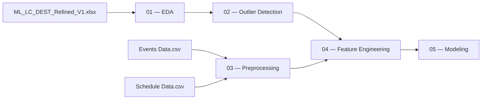

# Train Dwell Time Prediction

## Context & Motivation

Train delays ripple across the entire network — missed connections, late freight, cascading operational failures. This project was initiated during an internship at **Infosys InStep** in collaboration with an Indian railway company aiming to predict **train dwell time** using machine learning.

Improving dwell time prediction is a direct lever for timetable reliability: knowing how long a train will stay at a station lets dispatchers make better routing decisions in real time.

---

## Objective

Model the **dwell time of trains at station MINOT**, defined as the last change point for all trains in the dataset.

> **Dwell Time** = Departure Time at MINOT − Arrival Time at MINOT

This is a **regression problem**. The train/test split is temporal — models are trained on data before January 1, 2024 and evaluated on 2024 data.

---

## Data

> The datasets are proprietary and are **not included** in this repository.

| File | Description |
|------|-------------|
| `ML_LC_DEST_Refined_V1.xlsx` | Main dwell time table — one row per train arrival at MINOT (`TRAIN_ID`, `TA`, `TD`, `DWELL_TIME`, `REQ_INSP`) |
| `Events Data.csv` | Planned train movements across the network (`TRN_TYPE`, `TRN_PRTY`, `EVT_CD`, `EVT_DTTM`) |
| `Schedule Data.csv` | Actual train movements at track level (`TRN_SCH_DPT_DT`, `STN_333`, `TRK_NUMB`) |

The main dataset contains **693 unique trains**. After outlier removal, **403 trains** are kept for modeling.

---

## Pipeline

```mermaid
graph LR
    A[ML_LC_DEST_Refined_V1.xlsx] --> NB01
    B[Events Data.csv] --> NB03
    C[Schedule Data.csv] --> NB03
    NB01["01 — EDA"] --> NB02["02 — Outlier Detection"]
    NB02 --> NB04["04 — Feature Engineering"]
    NB03["03 — Preprocessing"] --> NB04
    NB04 --> NB05["05 — Modeling"]
```

---

## Notebooks

### 01 — Exploratory Data Analysis

EDA on the main dwell time table: distribution plots, categorical feature exploration, missing value analysis, and basic cleaning. Dwell time is heavily right-skewed — most trains dwell under 5 hours, but some exceed 100 hours.

---

### 02 — Outlier Detection and Removal

IQR-based filtering was too aggressive on this skewed distribution, so a custom binning strategy was used instead:

1. Bin dwell times with variable-width bins (0.5h steps for 0–10h, then coarser)
2. Discard bins representing less than 5% of training data
3. Flag records outside the surviving range as `IS_OUTLIER`

Valid dwell time range after filtering: **0.5h to 3.0h** — 290 outliers removed.

---

### 03 — Preprocessing Supplementary Tables

Preparation of the Events and Schedule tables for merging:

- Reconstructed `TRAIN_ID` from its component columns (`TRN_TYPE`, `TRN_SYM`, `TRN_SECT`, `TRN_DAY`, `TRN_PRTY`)
- Matched on `(TRAIN_ID, STN_333, STN_ST)`, kept first arrival and last departure per train
- Output: 43,588 unique trains with arrival/departure timestamps, ready to join with the main dataset

---

### 04 — Feature Engineering and Correlation

Merges the main dataset with the supplementary tables and constructs **14 features** across three groups:

| Group | Features |
|-------|----------|
| **Temporal** | Hour of Day, Day of Week, Day Type, Month, Is Holiday |
| **Operational** | Inspection Requirement, Train Priority, Mainline |
| **Congestion** | AllTrains, YardTrains, MainlineTrains, PriorityTrains, PriorityYard, PriorityMainline |

Congestion features count the number of overlapping trains at the time of each arrival, split by inspection status and priority. They are the most complex to compute and are highly inter-correlated (expected):

A first ElasticNet baseline was also run at the end of this notebook.

---

### 05 — Modeling

Loads the feature-engineered dataset and trains 7 regression models, progressing from linear baselines to tree-based ensembles:

| Model | Feature scaling |
|-------|----------------|
| Linear Regression | Yes |
| Ridge | Yes |
| Lasso | Yes |
| ElasticNet | Yes |
| Random Forest | No |
| Gradient Boosting | No |
| XGBoost | No |

Evaluation covers MAE, RMSE, and R² on both train and test sets, with residual analysis and feature importance plots for tree-based models.

> Model results are not published — the data is proprietary.

---

## Tech Stack

Python 3.10 · pandas · scikit-learn · XGBoost · matplotlib · seaborn · plotly

---

## Author

**Rita Berrada El Azizi**
Data Scientist & Global Engineering Student
_Infosys InStep 2025 — Indian Railways ML Project_

---

## License

MIT License — see `LICENSE` for details.
