# Train Dwell Time Prediction

## Context & Motivation

Train delays are not just an inconvenience — they ripple across the entire network, causing missed connections, late freight deliveries, and cascading operational failures. This project was initiated during an internship at **Infosys InStep** in collaboration with an Indian railway company aiming to better understand and predict **train dwell time** using machine learning.

Improving dwell time prediction is a direct lever for timetable reliability: if we know how long a train will stay at a given station, dispatchers can make better routing decisions in real time.

---

## Objective

We focus on a specific set of trains and model their **dwell time at the station MINOT**, defined as the **last change point** for all trains in the dataset.

> **Dwell Time** = Departure Time at MINOT − Arrival Time at MINOT

This is a **regression problem** with a temporal train/test split (training on data before 2024, testing on 2024 data).

---

## Data

> The datasets used in this project are proprietary and belong to the railway company. They are **not included** in this repository.

Three source tables were used:

| File | Description | Key columns |
|------|-------------|-------------|
| `ML_LC_DEST_Refined_V1.xlsx` | Main dwell time table — one row per train arrival at MINOT | `TRAIN_ID`, `TA` (arrival), `TD` (departure), `DWELL_TIME`, `REQ_INSP` |
| `Events Data.csv` | Planned train movements across the network | `TRN_TYPE`, `TRN_PRTY`, `EVT_CD`, `EVT_DTTM`, `STN_333` |
| `Schedule Data.csv` | Actual train movements (track-level) | `TRN_SCH_DPT_DT`, `STN_333`, `TRK_NUMB` |

The main dataset contains **693 unique trains**. After outlier removal (notebook 02), **403 trains** are kept for modeling (~58%).

---

## Pipeline

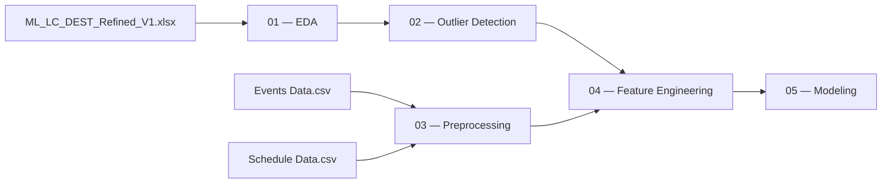
```mermaid
graph LR
    A[ML_LC_DEST_Refined_V1.xlsx] --> NB01
    B[Events Data.csv] --> NB03
    C[Schedule Data.csv] --> NB03
    NB01["01 — EDA"] --> NB02["02 — Outlier Detection"]
    NB02 --> NB04["04 — Feature Engineering"]
    NB03["03 — Preprocessing"] --> NB04
    NB04 --> NB05["05 — Modeling"]
```

---

## Notebooks Overview

### `01_EDA_Dwell_Time_Data.ipynb`

Classic EDA on the main dwell time table:
- Distribution plots and descriptive statistics
- Categorical feature exploration (destination, inspection type)
- Missing value analysis
- Basic cleaning: removed 6 constant columns, parsed datetimes, created binary `INSPECTION_REQUIRED` flag

**Dwell time is heavily right-skewed** — most trains dwell under 5 hours, but some stay for over 100 hours.

---

### `02_Outlier_Detection_and_Removal.ipynb`

Outlier detection is critical to avoid the model learning from anomalous stops.

- **First attempt**: IQR-based filtering → rejected (distribution too skewed, IQR too narrow)
- **Second attempt**: custom binning strategy → retained

**Steps:**
1. Temporal train/test split: training = records with `TA` before January 1, 2024
2. Bin dwell times with variable-width bins (0.5h intervals for 0–10h, 1h for 10–20h, 5h for 20h+)
3. Keep only bins representing ≥ 5% of training trains
4. Compute lower/upper bounds → flag `IS_OUTLIER`

**Result:** valid dwell time range = **0.5h to 3.0h**. 290 outliers flagged, 403 trains kept.

---

### `03_Preprocessing_Supplementary_Tables.ipynb`

Preparation of the **Events** and **Schedule** tables, which are later merged with the main dataset to compute congestion features:

- Parsed and cleaned both CSVs
- Reconstructed `TRAIN_ID` from component columns (`TRN_TYPE`, `TRN_SYM`, `TRN_SECT`, `TRN_DAY`, `TRN_PRTY`)
- Matched on `(TRAIN_ID, STN_333, STN_ST)` to find common records
- Split events by type (`TA` = arrival, `TD` = departure), kept first arrival and last departure per train
- Output: **43,588 unique trains** with both arrival and departure timestamps, ready to merge

---

### `04_Feature_Engineering_and_Correlation.ipynb`

This is the main feature engineering notebook. It merges the main dataset with the supplementary tables and constructs **14 features**.

Key engineering steps:
- Merged on `TRAIN_ID` and arrival time
- Computed track-level congestion counts (AllTrains, YardTrains, etc.) by counting overlapping trains at the time of each arrival
- Extracted temporal features from arrival timestamp (`TA`)
- Applied holiday calendar
- One-hot encoded categorical features
- Saved the final feature matrix to `../data/features_engineered.csv`

Feature correlation heatmap — congestion features are highly inter-correlated (expected):

Also ran a first modeling attempt (ElasticNet) as a baseline directly in this notebook.

---

### `05_Modeling.ipynb`

Loads the feature-engineered dataset from notebook 04 and trains 7 regression models:

| # | Model | Scaling |
|---|-------|---------|
| 1 | Linear Regression | Yes (StandardScaler) |
| 2 | Ridge Regression | Yes |
| 3 | Lasso Regression | Yes |
| 4 | ElasticNet Regression | Yes |
| 5 | Random Forest | No |
| 6 | Gradient Boosting | No |
| 7 | XGBoost | No |

**Evaluation:** MAE, RMSE, R² — computed on both train and test sets.

**Train/test split:** same temporal split as notebook 02 — trains before 2024-01-01 form the training set, trains from 2024 form the test set. This prevents data leakage.

Results include model comparison charts, predicted vs actual plots, residual analysis, and feature importance for tree-based models.

---

## Feature Engineering — Detailed Breakdown

All 14 features, with distributions and insights:

---

### Inspection Requirement

Whether the train requires an inspection upon arrival at MINOT (technical checks, routine maintenance, etc.)

- **Y** = inspection required
- **N** = no inspection needed

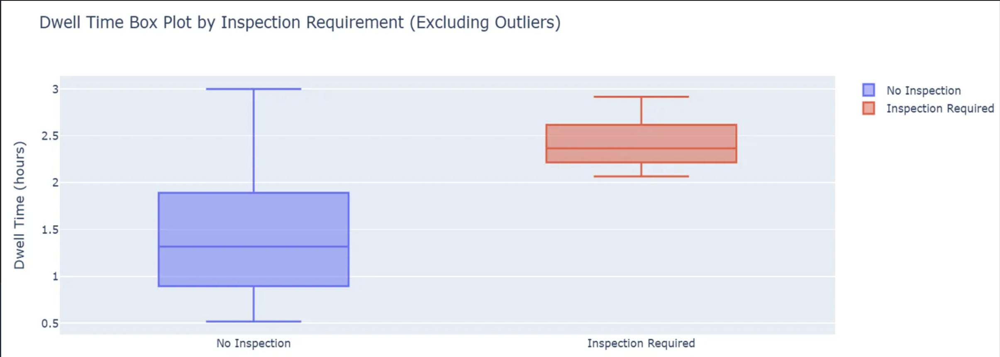

**Insight:** Dwell time is significantly higher when inspection is required — as expected, since trains must wait in the yard.

---

### Is Holiday

Whether the train arrived on a national holiday.

- **1** = holiday
- **0** = not a holiday

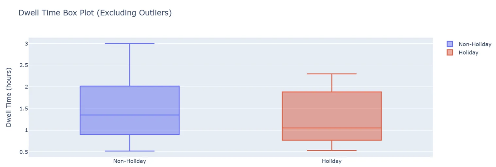

**Insight:** Dwell time is slightly lower on holidays — possibly due to reduced network traffic meaning less waiting for a clear path.

---

### Train Priority

Each train carries a priority flag indicating its operational importance.

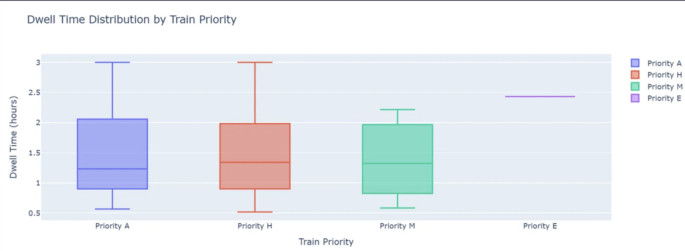

**Insight:** Priority levels H and M show similar dwell distributions; lower-priority trains tend to dwell longer (they yield to higher-priority traffic).

---

### Mainline

Whether the train is on mainline track (track 6398 or 6399).

- **1** = mainline
- **0** = not mainline

**Insight:** No significant difference in dwell time between mainline and non-mainline trains overall.

---

### Day of Week

Day of the week on which the train arrived.

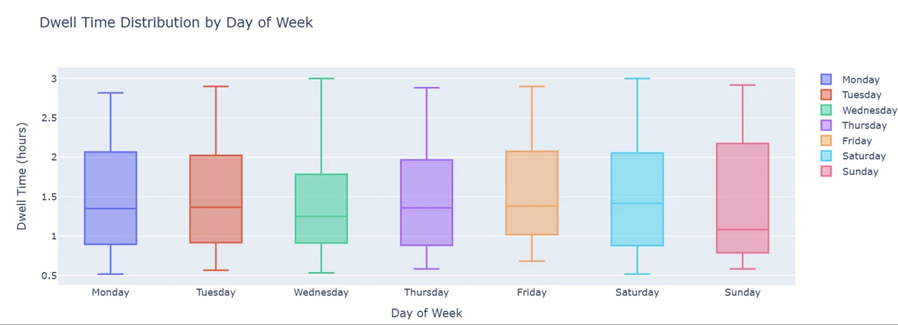

**Insight:** Dwell time increases from mid-week to the weekend — lowest on Wednesday, highest on Saturday.

---

### Day Type

Weekend vs weekday flag.

- **1** = weekend
- **0** = weekday

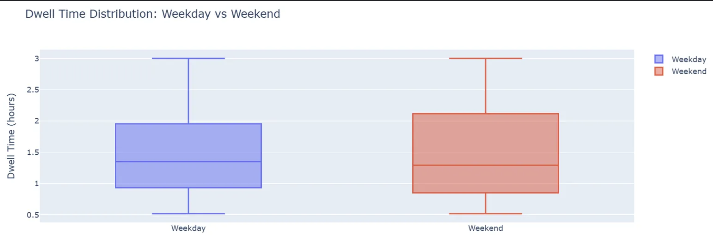

**Insight:** Aggregated into Weekday/Weekend, the difference flattens out — day-of-week is a more informative feature than this binary flag.

---

### Month

Month of arrival.

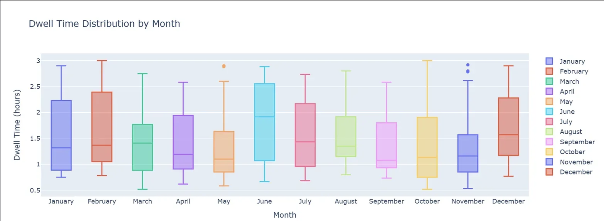

**Insight:** Dwell time varies significantly by month — higher in June, February, and December; lower in May and September. Likely tied to seasonal traffic patterns and weather-related delays.

---

### Hour of Day

Hour of the day when the train reaches MINOT.

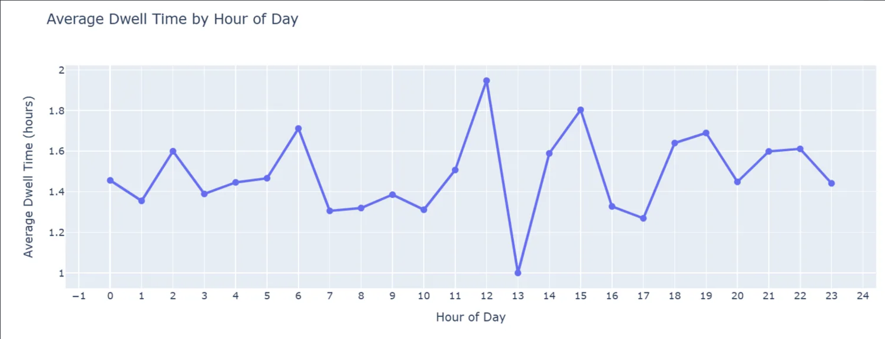

**Insight:** Dwell time peaks around 1 PM, with a secondary peak in the early morning. Likely reflects shift changes and midday congestion.

---

### AllTrains

Number of other trains present on the track at the same time as the train being analyzed — either already there on arrival, or arriving before the train departs.

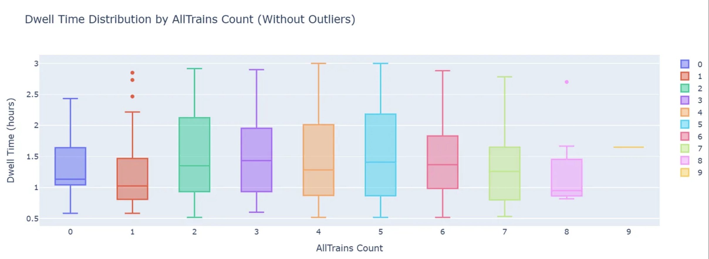

**Insight:** Moderate positive trend — more concurrent trains → longer dwell.

---

### YardTrains

Subset of AllTrains that require inspection and are moved to the yard.

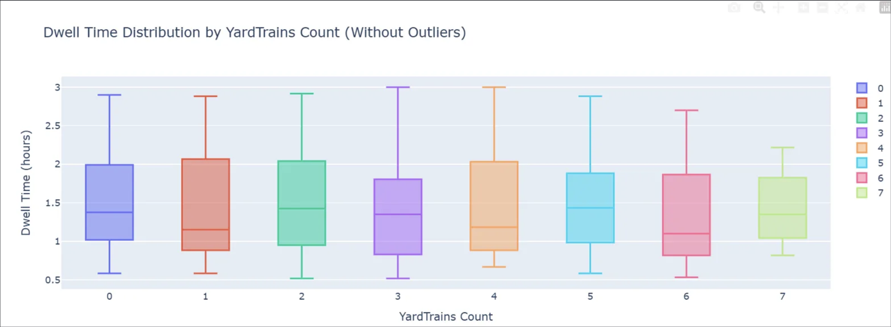

**Insight:** Even a small number of yard trains noticeably increases dwell time, as they create bottlenecks in yard operations.

---

### MainlineTrains

Subset of AllTrains that don't require inspection and remain on the mainline. Computed as `AllTrains − YardTrains`.

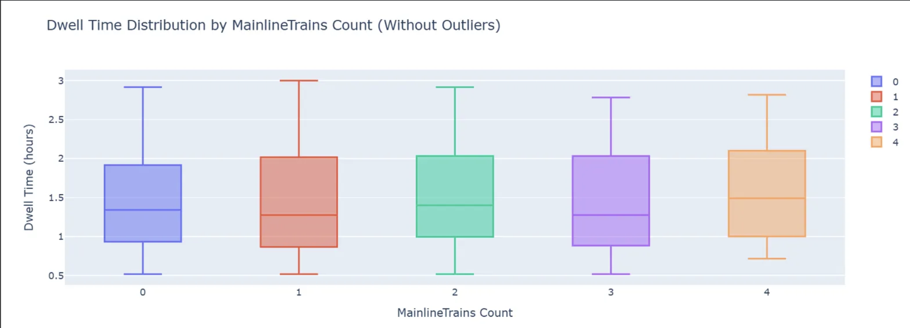

**Insight:** More mainline trains → higher dwell, as trains wait for a clear slot on the mainline.

---

### PriorityTrains

High-priority trains from AllTrains (priority codes A, B, G, H, Q, Z, S, V).

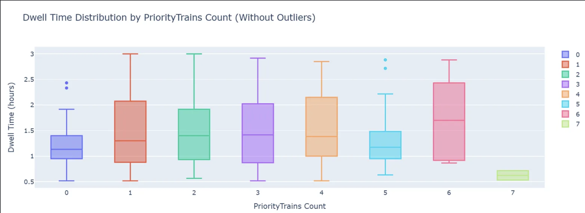

**Insight:** Each additional priority train increases waiting time, as lower-priority trains yield.

---

### PriorityYard

Priority trains that also require yard inspection.

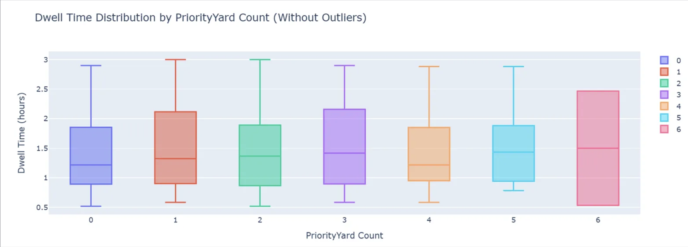

**Insight:** Dwell time increases sharply with the number of priority yard trains — they occupy yard slots while still blocking mainline moves.

---

### PriorityMainline

Priority trains remaining on the mainline (no inspection required). Computed as `PriorityTrains − PriorityYard`.

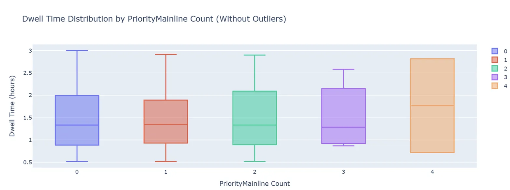

**Insight:** Similar positive trend — more priority mainline trains means more yielding for the analyzed train.

---

## Modeling Approach

**Problem type:** Regression — predicting a continuous dwell time in hours.

**Train/test split strategy:** Temporal split at January 1, 2024. All records before this date form the training set; records from 2024 form the test set. Random splitting was deliberately avoided to prevent data leakage from future information.

**Evaluation metrics:**
- **MAE** (Mean Absolute Error) — average error in hours, easy to interpret
- **RMSE** (Root Mean Squared Error) — penalizes large errors more heavily
- **R²** — proportion of variance explained

**Models:** Progressed from simple linear baselines to tree-based ensembles. Linear models (Ridge, Lasso, ElasticNet) establish an interpretable baseline. Tree-based models (Random Forest, Gradient Boosting, XGBoost) capture non-linear interactions between features.

> Due to data confidentiality, model performance results are not published in this repository.

---

## Author

**Rita Berrada El Azizi**
Data Scientist & Global Engineering Student
_Infosys InStep 2025 — Indian Railways ML Project_

---

## License

This project is under the MIT License. See `LICENSE` for details.
