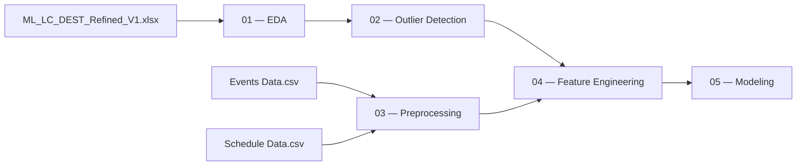
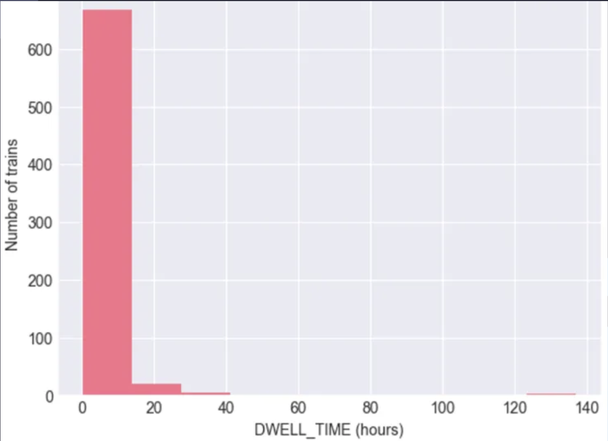
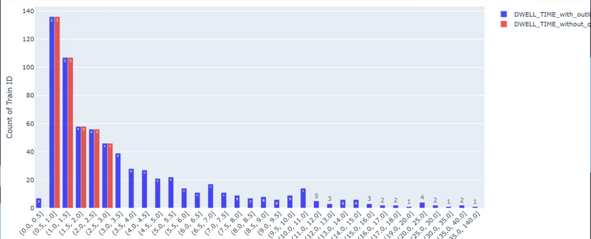
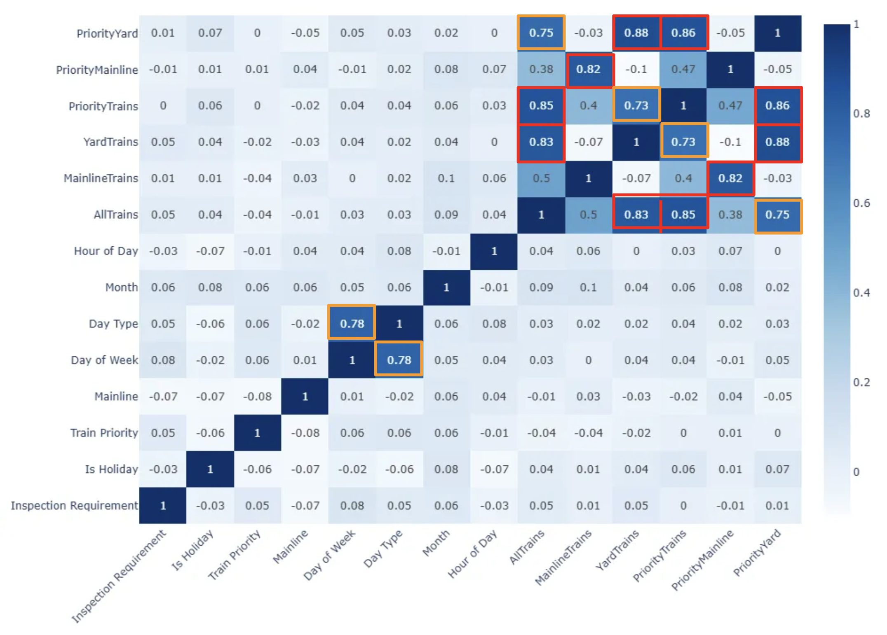

# Train Dwell Time Prediction

## Context

This project was completed as part of an **Infosys InStep internship**, in collaboration with an **Indian railway company**. The goal was to build an end-to-end machine learning pipeline to predict **train dwell time**, the time a train spends stationary at a given station, using historical operational data.

Accurate dwell time prediction is a key input for real-time dispatching systems. It allows operators to anticipate delays, optimize track allocation, and improve overall network reliability.

## Objective

Predict the **dwell time of trains at station MINOT**, defined as the last recorded change point for all trains in the dataset.

> **Dwell Time** = Departure Time at MINOT − Arrival Time at MINOT

The problem is framed as a **regression task**. The train/test split is temporal : models are trained on data prior to January 1, 2024 and evaluated on 2024 records.

## Data

> The datasets are proprietary and are **not included** in this repository.

| File | Description |
|------|-------------|
| `ML_LC_DEST_Refined_V1.xlsx` | Main dwell time table — one row per train arrival at MINOT (`TRAIN_ID`, `TA`, `TD`, `DWELL_TIME`, `REQ_INSP`) |
| `Events Data.csv` | Planned train movements across the network (`TRN_TYPE`, `TRN_PRTY`, `EVT_CD`, `EVT_DTTM`) |
| `Schedule Data.csv` | Actual train movements at track level (`TRN_SCH_DPT_DT`, `STN_333`, `TRK_NUMB`) |

The main dataset contains **693 unique trains**. After outlier removal, **403 trains** are retained for modeling.

## Pipeline

```mermaid
graph LR
    A[ML_LC_DEST_Refined_V1.xlsx] --> NB01
    B[Events Data.csv] --> NB03
    C[Schedule Data.csv] --> NB03
    NB01["01 — EDA"] --> NB02["02 — Outlier Detection"]
    NB02 --> NB04["04 — Feature Engineering"]
    NB03["03 — Preprocessing"] --> NB04
    NB04 --> NB05["05 — Modeling"]
```

## Notebooks

### 01 — Exploratory Data Analysis

EDA on the main dwell time table, covering distribution analysis, categorical feature exploration, missing value handling, and basic cleaning. Dwell time is heavily right-skewed : most trains dwell under 5 hours, with some exceeding 100 hours.

### 02 — Outlier Detection and Removal

IQR-based filtering was ineffective on this skewed distribution. A custom binning strategy was used instead: dwell times are binned with variable-width intervals, and any bin representing less than 5% of the training data is discarded. Records outside the surviving range are flagged as outliers.

Valid dwell time range after filtering: **0.5h to 3.0h** with 290 outliers removed.

### 03 — Preprocessing Supplementary Tables

The Events and Schedule tables are cleaned and prepared for merging. `TRAIN_ID` is reconstructed from its component columns (`TRN_TYPE`, `TRN_SYM`, `TRN_SECT`, `TRN_DAY`, `TRN_PRTY`), records are matched on `(TRAIN_ID, STN_333, STN_ST)`, and the first arrival and last departure per train are retained. The output covers 43,588 unique trains with full arrival/departure timestamps.

### 04 — Feature Engineering and Correlation

The main dataset is merged with the supplementary tables to construct **14 features** across three groups:

| Group | Features |
|-------|----------|
| Temporal | Hour of Day, Day of Week, Day Type, Month, Is Holiday |
| Operational | Inspection Requirement, Train Priority, Mainline |
| Congestion | AllTrains, YardTrains, MainlineTrains, PriorityTrains, PriorityYard, PriorityMainline |

Congestion features count overlapping trains at the time of each arrival, broken down by inspection status and priority level. They are the most complex to compute and are highly inter-correlated as expected.

### 05 — Modeling

Loads the feature-engineered dataset and trains 7 regression models, progressing from linear baselines to tree-based ensembles:

| Model | Feature Scaling |
|-------|----------------|
| Linear Regression | Yes |
| Ridge | Yes |
| Lasso | Yes |
| ElasticNet | Yes |
| Random Forest | No |
| Gradient Boosting | No |
| XGBoost | No |

Evaluation covers MAE, RMSE, and R² on both train and test sets, with residual analysis and feature importance plots for tree-based models.

> Model performance results are not published as the underlying data is proprietary.

## Tech Stack

Python 3.10 · pandas · scikit-learn · XGBoost · matplotlib · seaborn · plotly

## License

MIT License — see `LICENSE` for details.
